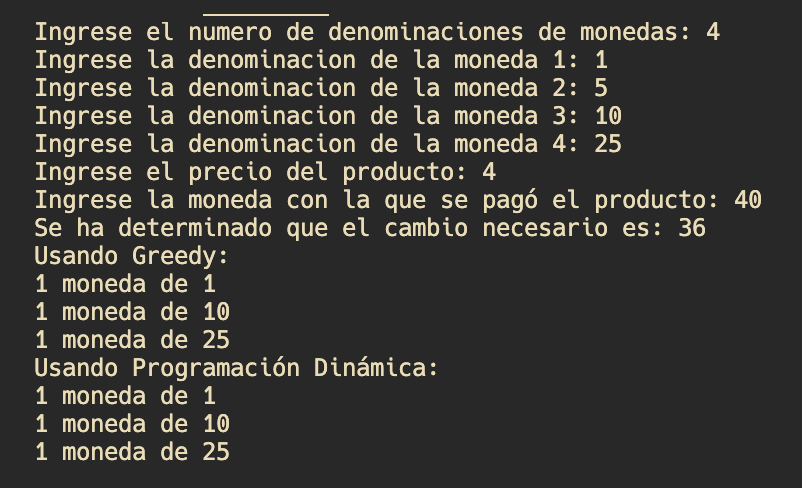
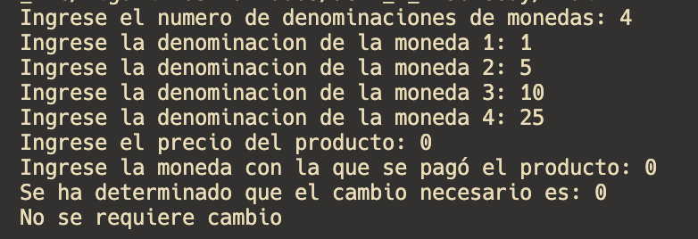
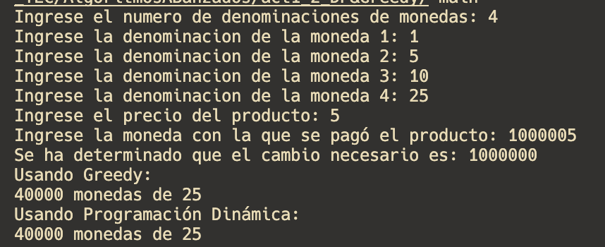
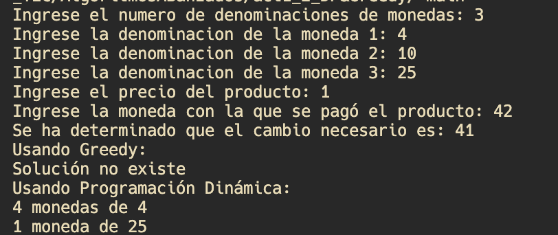

1. Test Case 1 - Normal Case

Code:

```c++
int main() {
    denom = {1, 5, 10, 25};
    escribeRespuesta(36);
    return 0;
}
```

Expected Output: 1, 10, 25 both greedy and dynamic


2. Test Case 2 - Edge Case no Change
   Code:

```c++
int main() {
    denom = {1, 5, 10, 25};
    escribeRespuesta(0);
    return 0;
}
```

Expected output: "No se requiere cambio" as no change is needed.


3. Test Case 3 - Extreme Case with Large Amount of Change
   Code:

```c++
int main() {
    denom = {1, 5, 10, 25};
    escribeRespuesta(1000000);
    return 0;
}
```

Expected output: 1, 5, 10, 25 both greedy and dynamic


4. Test Case 4 - No Greedy Solution
   Code:

```c++
int main() {
    denom = {4,10,25};
    escribeRespuesta(41);
    return 0;
}
```

Expected output: "No hay solucion greedy" as greedy solution is not possible, but dynamic solution is: 4, 4, 4, 4, 25

